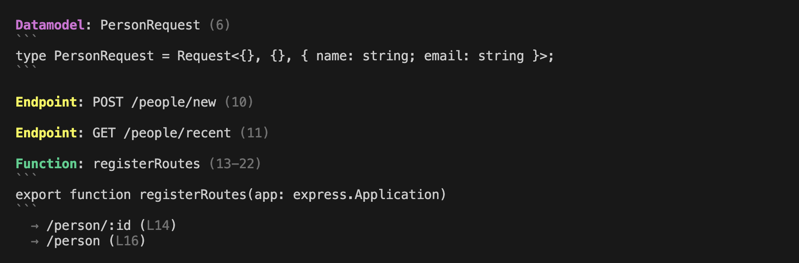
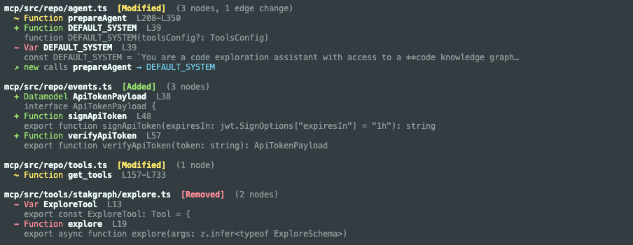

<p align="center">
  
</p>

<h3 align="center">Your AI agent wastes thousands of tokens reading files over and over.<br>Give it a code graph instead.</h3>

<p align="center">
  <a href="#install">Install</a> &bull;
  <a href="#cli">CLI</a> &bull;
  <a href="#mcp-server">MCP Server</a> &bull;
  <a href="#graph-server">Graph Server</a> &bull;
  <a href="#languages">Languages</a>
</p>

---

StakGraph parses source code into a graph of **functions, classes, endpoints, data models, tests**, and their relationships -- using [tree-sitter](https://tree-sitter.github.io/tree-sitter/), instantly, with zero config.

1. **CLI** -- install in 10 seconds, point at any file or directory
2. **MCP server** -- plug into Cursor, Claude Code, Windsurf, OpenCode
3. **Graph server** -- Neo4j-backed querying, embedding, and visualization

## Install

```bash
curl -fsSL https://raw.githubusercontent.com/stakwork/stakgraph/refs/heads/main/install.sh | bash
```

Pre-built binaries for **Linux** (x86_64, aarch64), **macOS** (Intel, Apple Silicon), and **Windows**.

## CLI

Point `stakgraph` at any file or directory. It parses the code, extracts every meaningful entity, maps their call relationships, and prints a structured summary.

### Parse a file

```
$ stakgraph src/routes.ts
```



Functions, endpoints, data models, classes, traits, tests -- all extracted with **line numbers**, **doc comments**, **signatures**, and **call edges** (`→`).

### Track code changes

See what actually changed at the structural level -- not line diffs, but which **functions, endpoints, and classes** were added, removed, or modified:

```
$ stakgraph changes diff --last 5 mcp/src/
```



Works with `--staged`, `--last N`, `--since <ref>`, or `--range HEAD~5..HEAD`. Builds before/after AST graphs from git blobs and computes the structural delta.

### Summarize a project

Get a token-budget-aware overview of any project, designed to fit into LLM context windows:

```
$ stakgraph summarize ./my-project --max-tokens 2000
```

Adaptive directory tree depth, file scoring (entry points first), and token counting via tiktoken. Shows functions, classes, endpoints, data models, and call edges within your budget.

### CLI options

```
stakgraph <files/dirs>                   # parse and print graph summary
stakgraph <files/dirs> --allow           # include unverified function calls
stakgraph <files/dirs> --skip-calls      # skip call graph extraction
stakgraph <files/dirs> --no-nested       # exclude nested nodes

stakgraph summarize <dir>               # token-budget project summary
stakgraph summarize <dir> --max-tokens N # set token budget (default: 5000)

stakgraph changes list <paths>           # list commits touching paths
stakgraph changes diff --staged          # graph diff of staged changes
stakgraph changes diff --last 3          # diff last 3 commits
stakgraph changes diff --since main      # diff since branch point
stakgraph changes diff --range a..b      # diff between two refs
```

---

## What it extracts

StakGraph understands the semantic structure of code, not just syntax:

| Node Type     | Examples                                              |
| ------------- | ----------------------------------------------------- |
| **Function**  | Functions, methods, handlers, callbacks               |
| **Endpoint**  | HTTP routes (`GET /users`, `POST /api/v1/login`)      |
| **Request**   | HTTP client calls to external services                |
| **DataModel** | Structs, interfaces, types, enums, schemas            |
| **Class**     | Classes with method ownership                         |
| **Trait**     | Interfaces, abstract classes, protocols               |
| **Test**      | Unit tests, integration tests, E2E tests (classified) |
| **Import**    | Module imports with resolution                        |

And the relationships between them:

| Edge Type      | Meaning                             |
| -------------- | ----------------------------------- |
| **Calls**      | Function A calls Function B         |
| **Handler**    | Endpoint handled by Function        |
| **Contains**   | File/Module contains Function/Class |
| **Operand**    | Class owns Method                   |
| **Implements** | Class implements Trait              |
| **ParentOf**   | Class inheritance                   |

---

## Languages

16 languages with framework-aware parsing:

| Language       | Frameworks                |
| -------------- | ------------------------- |
| **TypeScript** | React, Express, Nest.js   |
| **JavaScript** | React, Express            |
| **Python**     | FastAPI, Django, Flask    |
| **Go**         | Gin, Echo, net/http       |
| **Rust**       | Axum, Actix, Rocket       |
| **Ruby**       | Rails (routes, ERB, HAML) |
| **Java**       | Spring Boot               |
| **Kotlin**     | Spring, Ktor              |
| **Swift**      | Vapor                     |
| **C#**         | ASP.NET                   |
| **PHP**        | Laravel                   |
| **C / C++**    |                           |
| **Angular**    | Components, services      |
| **Svelte**     | Components                |
| **Bash**       |                           |
| **TOML**       | Config parsing            |

---

## MCP Server

The MCP server exposes StakGraph's graph intelligence to AI agents running in Cursor, Claude Code, Windsurf, OpenCode, or any MCP-compatible editor.

### Tools

| Tool                      | What it does                                                                    |
| ------------------------- | ------------------------------------------------------------------------------- |
| `stakgraph_search`        | Fulltext or vector (semantic) search across the codebase graph                  |
| `stakgraph_map`           | Visual map of code relationships from any node (configurable depth & direction) |
| `stakgraph_code`          | Retrieve actual code from a subtree                                             |
| `stakgraph_shortest_path` | Find shortest path between two nodes in the graph                               |
| `stakgraph_rules_files`   | Fetch rules/instructions files (.cursorrules, AGENTS.md, etc.)                  |

### Built-in agents

- **Explore Agent** -- AI-driven codebase exploration using the "zoom pattern" (Overview → Files → Functions → Dependencies). Configurable LLM provider (Anthropic, OpenAI, Google, OpenRouter).
- **Describe Agent** -- Generates descriptions for undocumented nodes and stores embeddings for semantic search.
- **Docs Agent** -- Summarizes documentation and rules files across the repo.
- **Mocks Agent** -- Scans for 3rd-party service integrations and records mock coverage.

### Gitree: Feature knowledge from git history

Gitree extracts feature-level knowledge from PR and commit history using LLM analysis:

```bash
yarn gitree process <owner> <repo>     # extract features from PR history
yarn gitree summarize-all              # generate docs for all features
yarn gitree search-clues "auth flow"   # semantic search across architectural clues
```

Builds a knowledge base of **Features**, **PRs**, **Commits**, and **Clues** (architectural insights like patterns, conventions, gotchas, data flows). Links them to code entities in the graph.

---

## Graph Server

For full-scale codebase indexing, StakGraph runs as an HTTP server backed by **Neo4j**:

```bash
docker-compose up    # starts Neo4j + StakGraph server on port 7799
```

### Ingest repositories

```bash
# Parse one or more repos into the graph
export REPO_URL="https://github.com/org/backend.git,https://github.com/org/frontend.git"
cargo run --bin index
```

Endpoints and requests are linked across repos -- a `POST /api/users` endpoint in the backend connects to the `fetch("/api/users")` request in the frontend.

### Query the graph


The graph stores 21 node types and 13 edge types. Query with Cypher, search with fulltext or vector similarity, or use the MCP tools.

### Vector search

Code is embedded using **BGE-Small-EN-v1.5** (384 dimensions) via fastembed. Weighted pooling prioritizes function signatures. Search semantically across the entire codebase:

```
POST /search
{ "query": "user authentication middleware", "limit": 10 }
```

### API endpoints

| Endpoint              | Description                             |
| --------------------- | --------------------------------------- |
| `POST /process`       | Parse and index a repository            |
| `POST /embed_code`    | Generate embeddings for code            |
| `GET /search`         | Fulltext or vector search               |
| `GET /map`            | Relationship map from a node            |
| `GET /shortest_path`  | Path between two nodes                  |
| `GET /tests/coverage` | Test coverage analysis                  |
| `POST /ingest_async`  | Background repo ingestion with webhooks |

---

## Architecture

```
stakgraph/
├── ast/          # Core Rust library: tree-sitter parsing → graph of nodes & edges
├── cli/          # CLI binary: parse, summarize, diff
├── lsp/          # LSP integration for precise symbol resolution
├── standalone/   # Axum HTTP server wrapping the ast library
├── mcp/          # TypeScript MCP server with agents, gitree, vector search
└── shared/       # Shared types
```

The `ast` crate is the engine. It takes source files, runs tree-sitter queries to extract nodes, resolves cross-file calls (optionally via LSP), and produces a graph. The graph can be:

- **In-memory** (`ArrayGraph`) -- used by the CLI, fast, no dependencies
- **Neo4j** (`Neo4jGraph`) -- persistent, queryable, used by the server

---

## Contributing

```bash
cargo test                # run tests
USE_LSP=1 cargo test      # run tests with LSP resolution
```

You may need to install LSPs:

```bash
# TypeScript
npm install -g typescript typescript-language-server

# Go
go install golang.org/x/tools/gopls@latest

# Rust
rustup component add rust-analyzer

# Python
pip install python-lsp-server
```

---

<p align="center">
  <a href="https://github.com/stakwork/stakgraph">github.com/stakwork/stakgraph</a>
</p>
